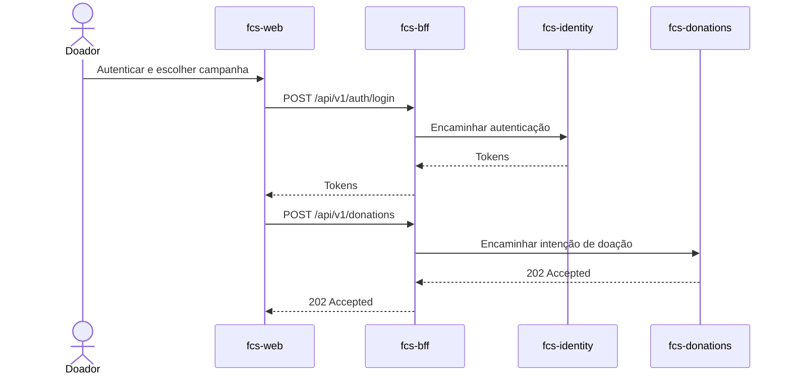

# fcs-web

Interface web da plataforma **Conexão Solidária**, criada para apoiar o MVP da ONG **Esperança Solidária** com cadastro de **Doador**, autenticação, painel público de transparência, fluxo de doação e operação administrativa por **GestorONG**.

Este repositório representa o cliente web da solução. As regras de negócio, autenticação, campanhas e doações ficam nas APIs do ecossistema Fase 05; o frontend consome essas APIs e mantém o vocabulário de domínio documentado em `docs/`.

## Contexto da solução

A Conexão Solidária conecta doadores a campanhas de arrecadação administradas por uma ONG. A arquitetura confirmada para a Fase 05 usa microsserviços, JWT/RBAC, Kafka, auditoria centralizada e infraestrutura VPS/K3s.

Aplicações relacionadas:

- `fcs-identity`: fachada de identidade, login, refresh, cadastro de **Doador** e perfil `/me`.
- `fcs-campaign`: gestão de campanhas e painel público de transparência.
- `fcs-donations`: recebimento de intenções de doação.
- `fcs-donation-worker`: processamento assíncrono de doações via Kafka.
- `fcs-audit-logs`: consumo e persistência de auditoria em MongoDB.
- `fcs-bff`: fachada HTTP que expõe as rotas consumidas pelo frontend.
- `fcs-infra`: ambiente integrado VPS/K3s, observabilidade e componentes compartilhados.

## Responsabilidades

O `fcs-web` deve concentrar a experiência de uso da plataforma:

- Exibir o **Painel de Transparência** com campanhas ativas e valores arrecadados.
- Permitir cadastro e login de **Doador** usando a `fcs-identity`.
- Permitir que um **Doador** autenticado envie uma **Intenção de Doação** para uma campanha ativa.
- Permitir que um **Doador** acompanhe suas próprias doações.
- Permitir que um **GestorONG** acesse fluxos administrativos de campanhas.
- Tratar erros das APIs no envelope `ApiResponse<T>` adotado pelos serviços.

O cliente não deve chamar o Keycloak diretamente. As chamadas HTTP passam pelo `fcs-bff`, que encaminha para os serviços de domínio; a autenticação é responsabilidade da `fcs-identity`.

## Stack

- Angular 21
- TypeScript 5.9
- PrimeNG 21
- Tailwind CSS 4
- Vitest para testes unitários
- ESLint, Prettier, Husky e lint-staged

Padrões locais:

- Componentes standalone.
- Signals para estado local.
- Rotas lazy quando features forem adicionadas.
- Templates com `@if`, `@for` e `@switch`.
- Injeção com `inject()`.
- Acessibilidade seguindo WCAG AA.

## Estrutura do projeto

```text
src/
  app/                 # Rotas, páginas, componentes e serviços Angular
  assets/              # Recursos estáticos
public/                # Arquivos públicos
Dockerfile             # Imagem de produção servida por Nginx
nginx.conf             # Configuração do servidor web
```

## Endpoints

O `fcs-web` consome o prefixo público `/api/v1` por meio do `fcs-bff`. Os contratos, erros e fluxos de exceção estão centralizados em [endpoint-flows.md](https://github.com/group10-tc-01/fcs-fase05-docs/blob/main/architecture/endpoint-flows.md).

### Fluxo principal



### Público

- Consultar campanhas ativas em `GET /api/v1/transparency/campaigns`.
- Cadastrar **Doador** em `POST /api/v1/auth/register/donor`.
- Realizar login em `POST /api/v1/auth/login`.

### Doador

- Consultar perfil em `GET /api/v1/me`.
- Criar intenção de doação em `POST /api/v1/donations`.
- Listar doações em `GET /api/v1/donations`.
- Consultar detalhe de doação em `GET /api/v1/donations/{id}`.

### GestorONG

- Consultar perfil em `GET /api/v1/me`.
- Criar campanha em `POST /api/v1/campaigns`.
- Editar campanha em `PUT /api/v1/campaigns/{id}`.
- Alterar status de campanha em `PATCH /api/v1/campaigns/{id}/status`.
- Listar e consultar campanhas administrativas em `GET /api/v1/campaigns`.
- Acompanhar doações conforme autorização da API.

## Pré-requisitos

- Node.js compatível com Angular 21.
- npm 11.
- `fcs-bff` e os serviços de domínio em execução localmente ou no ambiente integrado.

Instale as dependências:

```bash
npm install
```

## Subindo o ambiente local

Suba o servidor de desenvolvimento:

```bash
npm start
```

A aplicação fica disponível em:

```text
http://localhost:4200
```

## Testes

Rodar testes unitários:

```bash
npm run test:ci
```

Rodar lint:

```bash
npm run lint
```

Verificar formatação:

```bash
npm run format:check
```

Executar a verificação completa:

```bash
npm run verify
```

O comando `verify` executa formatação, lint, testes unitários e build de produção.

## CI/CD

Gerar build de produção:

```bash
npm run build
```

Os artefatos são publicados em `dist/`. O workflow `.github/workflows/angular-web-ci.yml` reutiliza `fcs-pipelines` para formatação, lint, testes, cobertura, build e validação da imagem Docker. A entrega da imagem no GHCR e no K3s é integrada à plataforma `fcs-infra`.

## Integração com as APIs

As APIs seguem o envelope `ApiResponse<T>`:

```json
{
  "success": true,
  "data": {},
  "errorMessages": null
}
```

Erros retornam `success: false`, `data: null` e uma lista em `errorMessages`.

Rotas públicas de negócio usam o prefixo:

```text
/api/v1
```

Rotas operacionais e internas não devem ser expostas ao usuário final:

```text
/health
/metrics
/internal/*
```

## Observabilidade

O frontend gera logs no navegador. A disponibilidade do contêiner, métricas e traces da plataforma são acompanhados pelo Datadog e pelos componentes de infraestrutura do `fcs-infra`. O acesso público é fornecido por Traefik com TLS.

## Kubernetes

O `fcs-web` é entregue como imagem Nginx no namespace `fcs-web` do K3s. Traefik, certificados e segredos são recursos compartilhados mantidos pelo `fcs-infra`; o frontend não expõe serviços internos nem endpoints operacionais das APIs.

## Banco de dados

O frontend é **stateless** e não possui banco de dados, migrations ou consumidores Kafka. A persistência pertence aos serviços de domínio.

## Segurança

- JWT emitido pelo Keycloak e obtido via `fcs-identity`.
- Roles canônicas: `Doador` e `GestorONG`.
- Validação de JWT e RBAC permanece nas APIs.
- O frontend deve usar a role apenas para experiência de navegação, nunca como única barreira de segurança.
- Segredos, URLs sensíveis e tokens reais não devem ser versionados.

## Referências

Documentação de arquitetura no workspace principal:

- `docs/CONTEXT.md`
- `docs/architecture/overview.md`
- `fcs-fase05-docs/architecture/endpoint-flows.md`
- `fcs-fase05-docs/adr/0001-keycloak-behind-identity-api.md`
- `fcs-fase05-docs/adr/0018-reuse-fcs-pipelines-for-ci-cd.md`

## Como este serviço atende ao hackathon

| Requisito do hackathon        | Onde é atendido                                                      |
| ----------------------------- | -------------------------------------------------------------------- |
| Experiência para doadores     | Cadastro, login, transparência e intenção de doação                  |
| Experiência administrativa    | Jornadas de campanhas para o perfil `GestorONG`                      |
| Integração com microsserviços | Consumo de `/api/v1` por meio do `fcs-bff`                           |
| Segurança                     | Tokens emitidos pela identidade e autorização preservada nas APIs    |
| Qualidade                     | Angular, ESLint, Prettier, Vitest e pipeline reutilizável            |
| Plataforma integrada          | Imagem Docker, GHCR, K3s, Traefik e observabilidade pelo `fcs-infra` |
